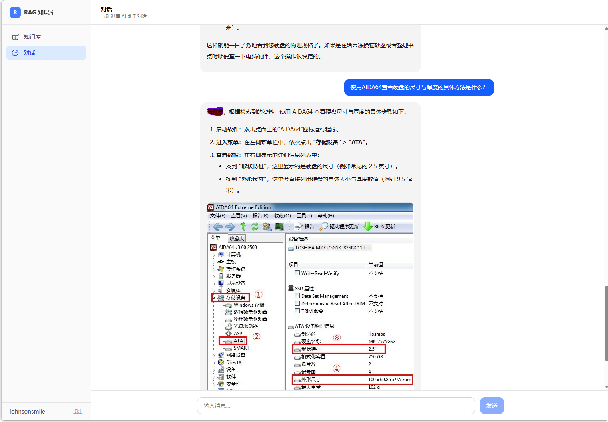
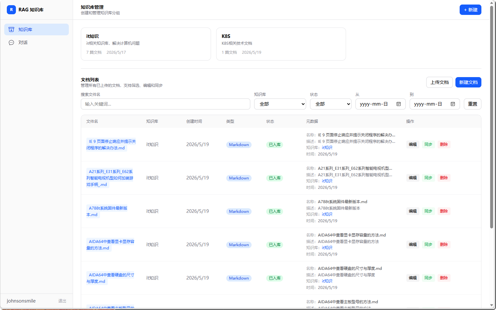
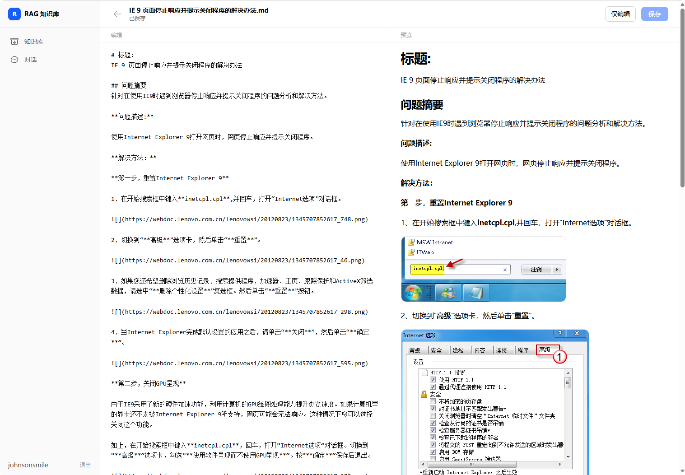

# Private Agent

项目受ima启发，打算做一个本地个人知识库，后续计划发展为一个个人微博系统，专门用来发布个人文档。也就是说后面还会单独写一个blog的页面。

基于 RAG 的私有知识库 AI 问答系统。支持文档上传解析、向量检索、多轮对话，并提供 Web UI 和 CLI 两种使用方式。

### 对话系统：



### 知识库管理



### 编辑知识库文档



## 架构

```
┌─────────────────────────────────────────────────────────┐
│                    Frontend (Next.js 16)                 │
│                Web UI (port 8080)                        │
├─────────────────────────────────────────────────────────┤
│                    Backend (FastAPI)                     │
│  ┌──────────┐  ┌──────────┐  ┌──────────────────────┐   │
│  │ Chat     │  │ Document │  │ Knowledge Base       │   │
│  │ Service  │  │ Service  │  │ Service              │   │
│  └────┬─────┘  └────┬─────┘  └──────────┬───────────┘   │
│       │              │                   │               │
│  ┌────▼──────────────▼───────────────────▼───────────┐   │
│  │              Agent (LangGraph)                     │   │
│  │    LLM 调用  →  上下文组装  →  流式输出             │   │
│  └─────────────────────┬─────────────────────────────┘   │
│                        │                                 │
│  ┌─────────────────────▼─────────────────────────────┐   │
│  │              Vector Store (Milvus)                 │   │
│  │               Embedding + 相似度检索                │   │
│  └───────────────────────────────────────────────────┘   │
├─────────────────────────────────────────────────────────┤
│                    CLI (Click)                            │
│         python main.py <chat|retrieve|server>             │
└─────────────────────────────────────────────────────────┘
```

## 功能

- **知识库管理** — 创建/删除知识库分组，管理文档
- **文档解析** — 通过 MinerU 解析 PDF/Word/图片等文件，提取文本并分块入库
- **向量检索** — 基于 Milvus + Embedding 模型的语义检索
- **AI 对话** — 结合检索结果的上下文增强问答，流式输出
- **对话历史** — 保存聊天记录，支持翻页查看历史
- **用户系统** — JWT 认证，注册/登录
- **CLI 工具** — 命令行检索和对话

## 快速开始

### 前置要求

- Python >= 3.12
- Node.js >= 20
- pnpm
- Milvus 服务（可选，否则使用内存模式）
- MinerU Docker 服务（可选，用于 PDF 解析）

### 安装

```bash
# 后端
uv sync

# 前端
cd web/rag && pnpm install
```

### 配置

复制环境变量并填写：

```bash
cp .env.example .env
```

关键配置项（在 `.env` 中）：

| 变量                  | 说明                                |
| --------------------- | ----------------------------------- |
| `DASHSCOPE_API_KEY`   | 通义千问 LLM API Key                |
| `SILICONFLOW_API_KEY` | SiliconFlow Embedding API Key       |
| `MILVUS_URI`          | Milvus 连接地址（留空使用内存模式） |
| `JWT_SECRET`          | JWT 签名密钥                        |
| `MINERU_BASE_URL`     | MinerU 服务地址                     |

### 启动

```bash
# 终端 1：启动后端
make server           # http://localhost:8001

# 终端 2：启动前端
make rag-web          # http://localhost:8080

# 启动 MinerU（如需解析 PDF）
make mineru-up

# 启动 milvus
make milvus-up

# 启动 langfuse
make langfuse-up
```

### CLI 使用

```bash
# 启动 HTTP 服务
python main.py server --port 8001

# 检索知识库
python main.py retrieve -q "你的问题"

# 对话
python main.py chat -q "你的问题"
```

## 项目结构

```
private_agent/
├── app/                    # 后端应用
│   ├── agent/              # LangGraph 智能体
│   │   ├── graph/          # 图编排
│   │   ├── nodes/          # 节点（chat, retrieve 等）
│   │   └── prompts/        # 提示词模板
│   ├── client/             # 客户端（数据库、Milvus）
│   ├── core/               # 核心配置、日志
│   ├── pkg/                # 第三方集成（Embedding）
│   ├── repository/         # 数据访问层
│   ├── server/             # FastAPI 服务
│   │   ├── router/         # 路由
│   │   ├── schema/         # Pydantic 模型
│   │   ├── models/         # SQLAlchemy 模型
│   │   └── dependency/     # 依赖注入
│   └── service/            # 业务逻辑
├── commands/               # CLI 命令
├── config/                 # YAML 配置
├── web/rag/                # 前端（Next.js 16）
│   └── app/                # App Router
│       ├── chat/           # 对话页
│       ├── editor/         # 文档编辑器
│       ├── knowledge/      # 知识库管理
│       ├── login/          # 登录
│       └── register/       # 注册
├── docker/                 # Docker 编排
├── tests/                  # 测试
└── main.py                 # 入口
```

## 技术栈

| 层        | 技术                                   |
| --------- | -------------------------------------- |
| 后端框架  | FastAPI + Uvicorn                      |
| 智能体    | LangGraph + LangChain                  |
| 向量库    | Milvus (PyMilvus)                      |
| 数据库    | SQLite (SQLAlchemy)                    |
| LLM       | Dashscope (Qwen)                       |
| Embedding | SiliconFlow (BGE)                      |
| 文档解析  | MinerU                                 |
| 前端      | Next.js 16 + React 19 + Tailwind CSS 4 |
| 认证      | JWT (PyJWT) + bcrypt                   |
| 可观测    | Langfuse                               |

## TODO 列表

- [x] 前端页面搭建
- [x] 后端接口搭建
- [x] agent 聊天历史模块
- [x] agent 短期记忆 滑动窗口+异步sumarize模块
- [ ] agent 长期记忆模块（语义记忆，情景记忆，程序记忆）
- [x] 知识库数据解析文档化（markdown,mineru,html,txt）
- [ ] 知识库数据解析优化（pdf解析改成使用unstructred，自定义解析规则）
- [ ] 知识库文档化优化（优化父子文档和元数据，提高召回率）
- [x] 知识库检索
- [ ] 知识库检索优化，BM25关键字多路召回配合父子文档以及大模型rerank重排
- [ ] self rag，自监督机制。
- [x] langfuse监控graph执行
- [ ] langfuse处理rag的retriever系统，并设置LLM-as-judge的脚本
- [ ] langfuse管理prompt，模型以及相关版本发布。
- [ ] 前后端接入langfuse 打分系统，增加用户反馈的渠道。
- [ ] 增加真正意义的多conversation，多用户支持。
- [ ] 重构一版本flutter的支持桌面以及相关后台以及llm的配置化。
- [ ] 重构脱离langfuse，自我实现相关监控，prompt版本发布以及score反馈的版本。
- [ ] docker化，服务器部署docker服务，桌面，或者移动端安装对应应用或者直接访问web页面。
- [ ] 重构sqlite为postgres或者mysql，或者可以动态配置。包括向量数据库最好也可以动态配置。
